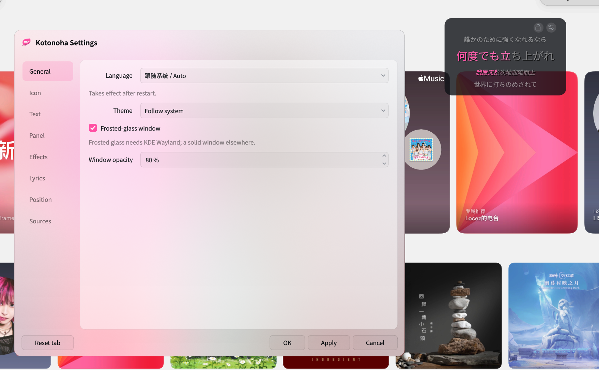

# Kotonoha

Kotonoha is a Linux desktop **lyrics overlay**: a translucent, click-through, top-most window that floats above fullscreen apps on Wayland and shows synchronized lyrics for whatever you're playing.

It works with **any MPRIS player** (browser YouTube Music, Spotify, VLC, mpv, Cider, …): it reads the now-playing track and progress over D-Bus, then resolves timed lyrics from **Netease**, **lrclib**, **Kugou**, or optionally the **Cider** plugin's Apple Music lyrics. Sources can be enabled and reordered, and the resolver can choose the highest-confidence match while using your order to break ties.

Built on the same core stack as BiliHUD: Python, PyQt6, qasync, and a `layer-shell-qt` bridge.



> **Icon credit:** Special thanks to [Zakkaus](https://github.com/Zakkaus) for designing Kotonoha's icon.

## Features

- **Works with any MPRIS player** through D-Bus — no player-specific plugin is required. YouTube Music, Spotify, VLC, mpv, Cider, and other compatible players can share the same overlay.
- **Karaoke-style synchronized lyrics** with word-by-word highlighting when word timing is available, plus previous/current/next lines and an optional translation.
- **Multiple lyric sources**: Netease (word-timed YRC and Chinese translation), lrclib, Kugou, and the optional Cider Apple Music probe.
- **Flexible matching and fallback**: reorder or disable sources, compare match quality, tolerate noisy browser titles, and keep a provider-scoped local cache that can be disabled or cleared.
- **Customizable presentation**: choose fonts and sizes, panel style and width, opacity, position, translation script, accent colors, line transitions, glow, and active-word effects.
- **Wayland-friendly overlay**: stays above fullscreen apps through `wlr-layer-shell`, supports translucent and frosted panels, and can be locked into click-through mode while remaining draggable when unlocked.
- **Settings and system tray controls**: configure the overlay without stopping playback, choose separate tray and window icons, and switch between English, Simplified Chinese, Traditional Chinese, and Japanese UI text.
- **Smooth playback timing**: a local 60 fps clock interpolates between player progress samples and supports an adjustable lead offset.

Design docs: [`docs/SPEC.md`](docs/SPEC.md) (overlay) and [`docs/SPEC-mpris-lyrics.md`](docs/SPEC-mpris-lyrics.md) (MPRIS + lyrics).

## Installation

### Release and distribution packages

For Debian/Ubuntu and Fedora, download the latest release artifacts from the [GitHub Releases](https://github.com/locez/kotonoha/releases) page. Native packages are recommended because they install the desktop entry and resolve distribution dependencies automatically.

On Debian or Ubuntu:

```bash
sudo apt install ./kotonoha_*.deb
kotonoha
```

On Fedora:

```bash
sudo dnf install ./kotonoha-*.rpm
kotonoha
```

The native packages are built and tested on Ubuntu 26.04 and Fedora 43 respectively. Use a package intended for your distribution family; neither package is a universal Linux build.

On Gentoo, enable the [gentoo-zh overlay](https://github.com/gentoo-zh/overlay), sync it, and emerge Kotonoha:

```bash
sudo eselect repository enable gentoo-zh
sudo emaint sync
sudo emerge --ask media-plugins/kotonoha::gentoo-zh
kotonoha
```

On Arch Linux, install the AUR package with an AUR helper such as `paru`:

```bash
paru -S kotonoha-git
kotonoha
```

Other AUR helpers, such as `yay`, use the equivalent package command.

### Linux wheel

The release also includes a Linux x86_64 wheel. Install [`uv`](https://docs.astral.sh/uv/getting-started/installation/) if needed, then create an isolated environment, install the wheel, and start Kotonoha from that environment:

```bash
python3 -m venv .venv
uv pip install --python .venv/bin/python ./kotonoha-*-linux_x86_64.whl
.venv/bin/kotonoha
```

The wheel still needs compatible Qt, Wayland, and LayerShellQt runtime libraries. Its Qt minor version must match the runtime Qt provided by the system; see [Release packages](#release-packages) for the compatibility details.

### From source

Install `uv` and the platform dependencies listed below, then clone and install the project:

```bash
git clone https://github.com/locez/kotonoha.git
cd kotonoha
uv sync
```

## System dependencies

`uv sync` **compiles a small C++ Wayland bridge** (`libkoto-layer.so`) automatically through
scikit-build-core and CMake. Source builds need CMake, a C++ compiler, Qt6, Wayland, and layer-shell-qt:

```bash
# Arch
sudo pacman -S cmake qt6-base qt6-wayland layer-shell-qt
# Fedora
sudo dnf install cmake qt6-qtbase-devel layer-shell-qt-devel wayland-devel gcc-c++
# Debian/Ubuntu
sudo apt install cmake build-essential pkg-config qt6-base-dev qt6-base-private-dev qt6-wayland-dev libwayland-dev liblayershellqtinterface-dev
# Gentoo
sudo emerge -a dev-build/cmake kde-plasma/layer-shell-qt dev-qt/qtwayland
```

A prebuilt Linux wheel does not need CMake, a compiler, or development headers at install time. It
still requires compatible Qt, Wayland, and LayerShellQt runtime libraries as described under
[Release packages](#release-packages).

> Floating above fullscreen needs a compositor that implements `wlr-layer-shell`
> (KDE Plasma/KWin, wlroots-based). GNOME/Mutter does not — Kotonoha falls back to a
> normal top-most window there.
>
> Browser players (YouTube Music) reach MPRIS via the **Plasma Browser Integration**
> extension and/or `playerctld`.

## Run

From an installed source checkout:

```bash
uv run kotonoha          # add -v for verbose logs
```

To build and install the bridge directly into the project virtual environment with the standalone
CMake path:

```bash
cmake -S . -B build/cmake \
  -DCMAKE_BUILD_TYPE=Release \
  -DPython3_EXECUTABLE="$PWD/.venv/bin/python"
cmake --build build/cmake --config Release
cmake --install build/cmake --config Release --prefix "$PWD/.venv" --component KotonohaBridge
```

The KDE frosted-glass blur (`org_kde_kwin_blur`) is compiled in by default and
needs `wayland-scanner` (part of the `wayland` dev package) at build time. To
build without it, pass `-DKOTONOHA_ENABLE_BLUR=OFF` — the translucent panel
still renders, just unblurred. Packagers building a wheel can also pass
`-DKOTONOHA_INSTALL_LICENSE=OFF` to skip staging a second `LICENSE` copy.

Build a wheel with `uv build --wheel`. The existing shell path remains available as a manual fallback:

```bash
bash src/kotonoha/build_bridge.sh
```

Then just play something in any MPRIS player. Kotonoha shows a tray icon; left-click it to lock/unlock the overlay, right-click for Settings.

The app icon picker scans the top level of `src/kotonoha/assets/icons/` whenever Settings is opened. Add a PNG or SVG there and reopen Settings; no filename or code registration is needed. Subdirectories are ignored, identical files are shown only once, and a missing saved selection falls back to `src/kotonoha/assets/icon.png`.

**Lyric source priority** is in Settings → **Sources**: drag to reorder and uncheck to disable. The default order is `netease → lrclib → kugou → cider`.

With **Prefer best match** enabled (the default), cached results and a matching live Cider snapshot are considered without network access first. Network sources are then queried as needed, and the highest-confidence result wins; the configured order breaks ties. Disable that option to use strict ordered fallback, checking each provider's cache and then its network endpoint before moving to the next provider.

Reordering a provider moves its cache and network stages together. Cider is attempted at its configured position; it is not automatically preferred just because the active MPRIS player is Cider. Cache entries are stored by the provider's stable song ID and matched against the current playback metadata at lookup time.

## Cider probe (experimental, optional)

> **Experimental:** Current Cider 4 playback state and MusicKit timing are supported and have been runtime-tested, but the probe still depends on Cider's internal plugin APIs and Apple Music's TTML response. A future Cider update can require compatibility changes, and Apple Music lyrics may still be unavailable for individual tracks. Keep external lyric providers enabled.

The Cider plugin adds Apple Music's own TTML lyrics to the configured priority list. It also supplies song-relative playback time and duration when Chromium's MPRIS bridge exposes an HLS/media timeline instead of the real track duration. Matching Cider timing can therefore improve external lyric lookup and progression even when another external provider wins the configured provider order.

The plugin is not required for ordinary MPRIS playback or external providers. Build it with Vite + pnpm:

```bash
cd plugins/cider/lyrics
pnpm install
pnpm build
```

Install or update the built plugin in Cider's plugin directory:

```bash
install -d ~/.config/sh.cider.genten/plugins/dev.locez.kotonoha.cider.lyrics
cp dist/dev.locez.kotonoha.cider.lyrics/plugin.js \
  ~/.config/sh.cider.genten/plugins/dev.locez.kotonoha.cider.lyrics/plugin.js
cp dist/dev.locez.kotonoha.cider.lyrics/plugin.yml \
  ~/.config/sh.cider.genten/plugins/dev.locez.kotonoha.cider.lyrics/plugin.yml
```

Reload Cider after installing. Source changes under `plugins/cider/lyrics/` do not update the installed plugin automatically; run `pnpm build`, copy the two generated files again, then reload Cider.

The plugin connects to Kotonoha over WebSocket (`ws://127.0.0.1:28745/kotonoha/cider/lyrics`) and pushes Apple Music lyric snapshots, track metadata, and high-frequency playback ticks. Kotonoha retains the latest matching snapshot while external providers are being tried and only lets the selected connection drive lyric content. A matching snapshot may still correct unreliable MPRIS timing metadata without changing provider priority. `pnpm receive` runs a standalone debug receiver; `pnpm test` runs the unit tests.

During an MPRIS track transition, empty or partially updated metadata is held briefly instead of being searched immediately. A player that cannot expose `Position` can still resolve lyrics, although synchronized progression then depends on that player eventually providing usable progress.

## Release packages

Pushing a `vX.Y.Z` tag runs the complete Python and Cider test suites, builds the release packages, and
publishes a GitHub Release containing a DEB, an RPM, a Linux x86_64 wheel,
`kotonoha-cider-lyrics-X.Y.Z.zip`, and `SHA256SUMS`. The DEB is built and tested against Ubuntu 26.04
and is intended for compatible Debian/Ubuntu systems. The RPM is built and tested against Fedora 43
and is intended for compatible Fedora systems; neither is a universal Linux package. Both install a
multilingual desktop entry and the default application icon. Fedora does not currently package
qasync, so the RPM bundles the pinned qasync 0.28.0 pure-Python wheel from PyPI and includes its BSD
license; PyQt6 and the remaining native/runtime dependencies still come from Fedora repositories.

The wheel is a non-pure Linux x86_64 package containing Kotonoha's native LayerShellQt bridge. Its
PyQt6 runtime is constrained to the same Qt minor ABI used to build the bridge on Ubuntu 26.04; the
target system must provide compatible Qt, Wayland, and LayerShellQt libraries from that minor series.
It is not a Windows, macOS, manylinux, or cross-distribution portability claim.

The Cider ZIP contains `dev.locez.kotonoha.cider.lyrics/` as its top-level directory. Install the
downloaded ZIP under Cider's plugin directory:

```bash
install -d ~/.config/sh.cider.genten/plugins
unzip -o kotonoha-cider-lyrics-*.zip -d ~/.config/sh.cider.genten/plugins
```

Reload Cider after installing. The integration remains experimental; keep external lyric providers
enabled.

Maintainers create a release with:

```bash
git tag vX.Y.Z
git push origin vX.Y.Z
```

The manually dispatched **Package** workflow takes its version from `pyproject.toml` and produces the
same downloadable GitHub Actions artifacts. It never creates a GitHub Release, even when dispatched
against a tag ref. Before the first tag, run **Package** manually and confirm that its Ubuntu 26.04 and
Fedora 43 package jobs pass.

## Layout

```text
src/kotonoha/                 Python overlay application
  providers/mpris.py          MPRIS provider (dbus-fast): track + progress
  lyrics/                     Provider resolver, cache, Netease/lrclib, parsers, matching
  layer_shell_bridge.cpp      Wayland layer-shell bridge (-> libkoto-layer.so)
  overlay.py / karaoke_label  Translucent overlay + word-sweep renderer
  receiver.py                 aiohttp WebSocket server (Cider probe frames)
plugins/cider/lyrics/         Optional Cider Apple Music probe (WebSocket client)
```
