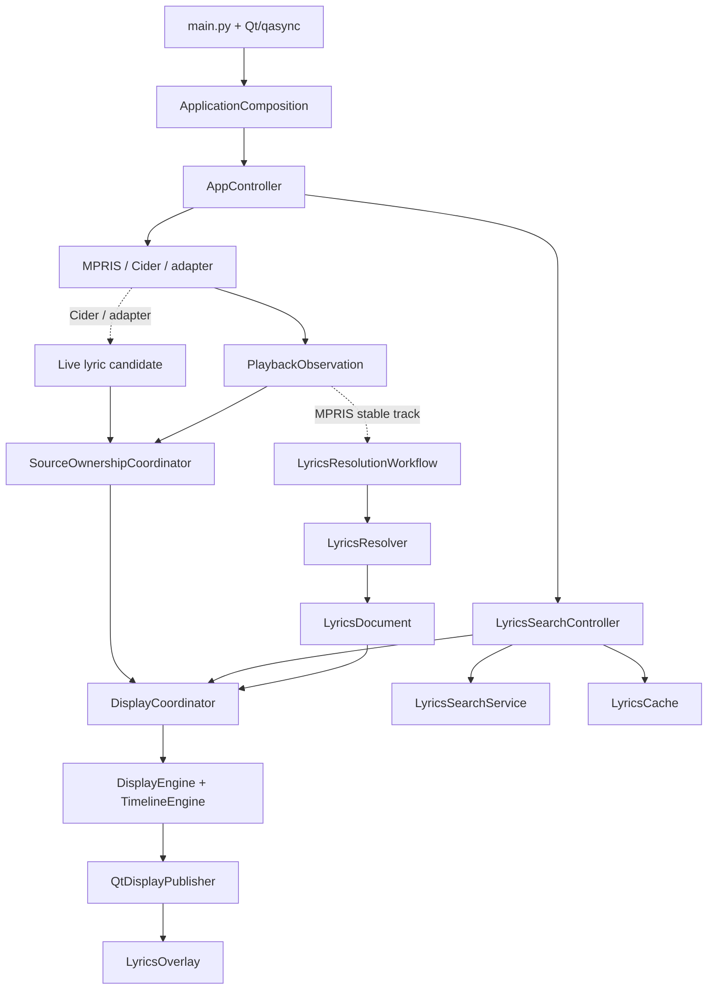

# 当前架构

本文只记录 Kotonoha 当前实现的系统边界、运行路径和资源生命周期。

## 运行路径

MPRIS、Cider 和外部 adapter 在边界转换为规范化播放事实；Cider 和 adapter 还可
携带 live 歌词候选。歌词来源和播放来源是两个维度。歌词文档进入
`DisplayCoordinator` 后，当前行、上下文、逐字进度和 interlude 才由 display 层计算。

## 分层

| 层 | 责任 | 代表模块 |
| --- | --- | --- |
| Domain | 值类型、歌词解析/匹配、时间轴和展示投影 | `lyrics/`、`playback/`、`display/` |
| Application | 用例、来源仲裁、配置应用和生命周期 | `app/` |
| Boundary | MPRIS D-Bus、Cider HTTP、adapter 接收 | `providers/`、`receiver.py` |
| Platform | compositor 能力、surface、output 和 native bridge | `platform/` |
| Presentation | Qt 窗口、控件、状态绑定和托盘 | `ui/`、`tray.py` |
| Configuration | typed `Config`、XDG 路径和原子持久化 | `config/`、`file_access.py` |

Domain 不依赖 Qt、网络客户端、D-Bus 或 native bridge；presentation 不创建
session、worker 或 cache；platform 不决定歌词来源策略。

## Owner

| Owner | 责任 |
| --- | --- |
| `ApplicationComposition` | 唯一的 concrete object graph 组合根，创建并注入所有实现 |
| `AppController` | 应用生命周期、Settings、cache 管理和手动搜索 intent |
| `SourceOwnershipCoordinator` | 仲裁 `mpris`、`cider`、`adapter` 播放候选及其 clock |
| `LyricsResolutionWorkflow` | generation、取消、过期结果隔离和解析决策 |
| `LyricsResolver` | source plan、匹配、cache 和共享查找任务 |
| `DisplayCoordinator` | `DisplayFrame`、MediaClock 和唯一 display publisher 边界 |
| `LyricsCache` | 一个 SQLite cache 的异步 facade；resolver 和管理窗口共享同一实例 |
| Provider / receiver | 各自拥有外部 session、轮询和连接资源 |

具体实现只在 `app/composition.py` 装配。模块不得通过全局 service、widget parent
或 deep helper 隐式寻找依赖，也不得创建第二套 publisher。

## 关键边界

- 外部 JSON、D-Bus、HTTP 和文件输入在边界处解析、校验并转换为 typed value。
- 歌词 provider 和 adapter 只传递完整 `LyricsDocument`，不传递当前行或上下文等展示派生字段。
- cache 管理使用 `LyricsCacheManagementPort`，手动应用使用 `LyricsCacheWritePort`；两者都指向组合根创建的同一个 `LyricsCache`，cache CRUD 不经过 MPRIS port。
- 平台能力用带原因的 capability/result 返回；UI 不直接读取 compositor 名称或 native bridge。
- overlay 拖动只使用平台策略进行坐标换算和位置同步。普通窗口和支持该行为的 Layer Shell 桌面保持连续跨屏；Niri 的 Layer Shell surface 绑定单一 output，因此拖动期间把可见面板限制在当前 output 的逻辑矩形内，避免向未绑定 output 提交无效边距。可跨屏重绑的路径仍只在释放时根据最终指针位置处理。

## 生命周期

- 构造函数只建立内存和 UI 状态，不执行网络 I/O、不启动 task、不注册进程级 hook。
- `AppController.start()` 依次激活 overlay、启动 display/search，再尝试启动 adapter、Cider 和 MPRIS；某个外部边界不可用不影响其它功能。
- `AppController.stop()` 先关闭窗口和 feature task，再停止 provider/receiver/display，释放 overlay surface 资源，最后关闭配置 service。
- 所有 task、session、worker 和 surface 都有明确 owner、取消或关闭路径；`start()`、`stop()`、`close()` 尽量幂等。
- MPRIS 没有独立关闭工作流；`MprisProvider.stop()` 只是应用关闭时的内部步骤，并负责结束 MPRIS lyric workflow 及其 resolver/cache 资源。

## 状态和配置

| 状态 | 值 | 含义 |
| --- | --- | --- |
| Playback source | `mpris`、`cider`、`adapter` | 当前播放事实和时钟的来源 |
| Lyrics source | provider 或本地来源 id | 生成当前歌词文档的来源 |
| Lyrics origin | `network`、`cache`、`live`、`sidecar`、`embedded`、`adapter`、`manual` | 文档进入显示路径的方式 |
| Cache state | `none`、`from-cache`、`manual` | 当前文档与持久 cache 的关系 |

配置默认位于 `$XDG_CONFIG_HOME/kotonoha/config.json`，cache 默认位于
`$XDG_CACHE_HOME/kotonoha/lyrics.sqlite3`；未设置对应变量时分别使用
`~/.config/kotonoha/` 和 `~/.cache/kotonoha/`。`Config` 是唯一 typed settings
model，token 不写入日志。

Wayland Layer Shell 不可用时使用普通 Qt window；blur 是独立 capability。重建
surface 或重新绑定 output 前，必须释放旧 surface 关联的 compositor 资源。

歌词、cache 和手动选词的细节见 [`SPEC-lyrics.md`](SPEC-lyrics.md)，外部 adapter
协议见 [`../plugins/README.zh-CN.md`](../plugins/README.zh-CN.md)。
