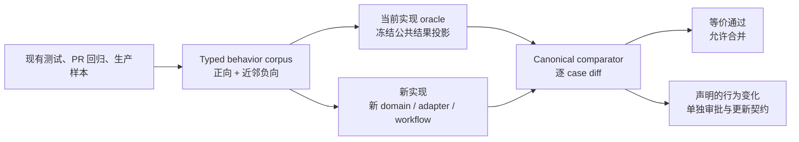

# 行为等价性与 corner case 保护

## 结论

**Observed**：当前正则和解析规则已经承载了真实输入语义。`src/kotonoha/lyrics/titles.py` 同时处理
平台标题、版本标记、上传者噪声、artist recovery、query variant 等规则；`krc_parser.py`、
`yrc_parser.py`、`lrc_parser.py` 还处理不同歌词格式的边界。相关行为分散在 `tests/test_lyrics.py`、
`tests/test_titles.py`、`tests/test_mpris_title_corpus.py` 和 provider/parser 测试中。

**Derived**：这些测试保护了很多单独 case，但当前没有一个统一的、跨实现迁移使用的行为 oracle。只
迁移主流程或替换正则，可能让局部测试通过，却丢失 raw/normalized 区别、版本冲突拒绝、上传者恢复
条件或近邻负例。

**Target**：行为等价测试是重构的合并门禁，不是覆盖率附属物。任何改变 grammar、parser、matcher、
resolver、display model 或 platform operation 的 PR 都必须证明：未声明的公共行为没有改变。

## 等价验证流程



## Case 模型

语料不是正则字符串快照，也不是对源代码做 substring 检查。每个 case 通过公开构造和公开接口表达：

```text
BehaviorCase[TInput, TPublicOutput]
    id: CaseId
    input: TInput
    expected: TPublicOutput
    negative_variants: tuple[TInput, ...]
    source: RegressionSource
    rule_ids: tuple[RuleId, ...]
```

`expected` 必须是稳定的公共结果投影：

| 行为 | 比较的公共结果 | 不比较的实现细节 |
| --- | --- | --- |
| title grammar | `TitleParts`、qualifier、artist evidence、query view | regex pattern、group 编号、helper 名称 |
| matching | `MatchEvidence`、confidence、reject reason | similarity 临时变量、排序实现 |
| lyric parser | canonical `LyricDocument`、timing invariant、拒绝 reason | parser 正则、临时 buffer |
| source workflow | `ResolutionDecision`、source 顺序、失败分类 | task 地址、HTTP client 具体调用 |
| display | `DisplayFrame`、state、line/word progress | QWidget 私有字段、paint 调用顺序 |
| platform | capability 和 `SurfaceResult`、pending intent | Qt/native pointer、compositor 私有对象 |

## 强制规则

1. 每个 grammar/parser rule 至少有一个正向 case 和一个最接近的负向 case；只测“能匹配”不算保护。
2. 同一个输入要覆盖组合路径：raw value、normalized view、gate、match 和 display 不得各自只测孤立函数。
3. 迁移期间由现有实现生成 baseline，新实现运行同一 corpus；比较 canonical public result，不比较源码。
4. 差异只能来自 `BehaviorChangeRecord`，其中必须写明 case id、旧结果、新目标、用户影响、替代原因和
   新契约测试。不能直接修改 expected 让 CI 变绿。
5. 规则被删除、合并或移动时，原 case 必须保留并标记为 `Retain`、`Redefine` 或 `Remove`；`Remove`
   也必须有测试证明新实现不会静默接受原输入。
6. 当前 oracle 只能在新实现成为唯一 publisher、等价 suite 连续通过且所有允许差异都已登记后删除。
7. 等价 suite 失败时，PR 必须停止在边界层修复；禁止在 MPRIS、Overlay 或测试 fake 中添加绕过语料的特例。

## 适用范围

以下变更必须运行等价 suite：

- `lyrics/titles.py`、`match.py`、`*_parser.py`、`hint.py`、`select.py`、`resolver.py`；
- `providers/mpris_track.py`、metadata stabilizer、source gate、query variant；
- `DisplayFrame`、timeline、interlude、word highlight、font fit；
- `OverlayPlatform` capability/result、surface/output/drag state machine；
- 任何改变 raw/normalized 字段、版本 marker、空值语义、失败 reason 或 provider precedence 的变更。

样本优先来自现有测试和最近 PR 的回归输入；新增 generated/property cases 只能补充 corpus，不能替代
可审阅的固定 case。测试必须通过 public API，不能通过 `object.__new__`、私有字段填充或读取源代码来
绕过生产契约。

## 当前仓库入口

- `tests/behavior_corpus.py` 定义 `BehaviorCase[TInput, TPublicOutput]`、歌词/匹配/展示的固定公共
  结果和 `compare_to_baseline`；`tests/behavior_runtime_corpus.py` 保存 gate、clock、platform 的
  runtime cases。expected 值是迁移期间的冻结 baseline。
- `tests/test_behavior_corpus.py` 通过当前 title grammar、LRC/YRC/KRC parser、matcher、timeline
  selector、raw-title lookup gate、Cider clock gate 和 platform operation result 运行 corpus，同时
  验证每条 case 有近邻负例。
- `docs/superpowers/behavior-changes/` 保存有意变化的 `BehaviorChangeRecord`；#62 的 LRC budget 和
  restart failure 已拆成两个独立记录。
- [Golden scenario 目录](2026-08-23-kotonoha-golden-scenarios.md) 索引跨模块输入、失败语义和当前
  测试证据；其中 `target` 场景必须在 Phase 1 的新 owner/API 落地后补齐。
