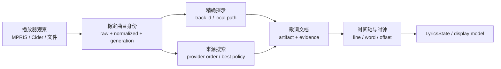

# 歌词相关 PR 行为矩阵

## Scope

- **目标**：还原最近 40 个提交中直接改变歌词获取、匹配、缓存、时间轴或时钟行为的 PR。
- **包含**：`#26`、`#32-#34`、`#36-#37`、`#40`、`#42`、`#45`、`#49-#51`、`#56-#59`、`#61-#64`，以及会影响歌词来源选择的 `#39`。
- **排除**：仅修改 packaging、settings 外观或平台测试运行方式的提交；它们在 Overlay 矩阵或总计划中说明。
- **证据**：对应 squash commit subject/body、commit diff 和当前 source/tests。

## 行为总图



## PR 行为目录

| PR | 实际改变的行为（Observed） | 必须明确的行为契约 | 目标归属 |
| --- | --- | --- | --- |
| `#26` | 播放器 artist 是频道、label、studio 时，从标题前缀恢复 performer；只有 title grammar 提供分隔证据才恢复，避免把整段标题当 artist。 | raw artist、title grammar、recovered artist 是三个视图；恢复失败不能覆盖原始值；恢复规则不能由某个 provider 私有化。 | `domain/track_identity` 的 `ArtistEvidence` 与纯 `TitleGrammar` |
| `#32` | 读取 MPRIS `mpris:trackid`/`xesam:url`，对支持的播放器直接按 provider song id 获取歌词；失败或 provider 未启用时回退搜索。 | hint 是优化，不是死路；精确 id 命中可以跳过匹配，但结果仍必须经过 payload/歌词有效性校验。 | `infrastructure/mpris` 产出 `ProviderHint`；`application/lyrics` 编排 fallback |
| `#33` | 将候选排序从布尔链改为 artist/title/album 的加权相似度；明确相似度只排序，不能跨过版本冲突或低置信度门槛。 | `MatchEvidence`、`MatchConfidence`、`RankingScore` 分离；分数不能单独代表“可接受”。 | `domain/matching` |
| `#34` | `file://` 播放器提示触发同目录 `.lrc`；sidecar 优先网络；UTF-8/GB18030 解码；路径越界拒绝；支持 LRC offset。 | local source 的 precedence、路径信任边界、编码和 offset 必须是 source contract；缺失/无效 sidecar 是 `Miss`，不是异常。 | `infrastructure/local_lyrics` + `application/source_plan` |
| `#36` | 增加 mutagen 可选的内嵌歌词读取；sidecar > embedded > network；USLT/Vorbis/MP4 tag 都复用 LRC parser；普通文本不是可展示歌词。 | optional dependency 的 unavailable 与 source miss 分开；文件句柄只在 adapter 内管理；tag shape 统一转成 `LyricDocument`。 | `infrastructure/local_lyrics` |
| `#37` | 用播放器提供的 QQ Music song id 做精确获取，减少 title search。 | 每种 `ProviderHint` 都有 provider、song id、来源可信度；未支持 hint 不得污染搜索请求。 | `domain/provider_hint` + provider adapter |
| `#39` | 设置页播放器行显示 bus identity，选择逻辑同时考虑 metadata、playing/paused、连续性。 | player selection 是 application policy；MPRIS bus object 不能传到 settings/UI；列表展示使用 `PlayerInfo` DTO。 | `application/playback` + `presentation/settings` |
| `#40` | Kugou KRC 的 word-level timing 不再丢弃；压缩歌词解析成带词时间的 line。 | parser 负责结构和预算，不能决定 provider 匹配；word timing 不完整时有明确 line-level fallback。 | `domain/lyric_document` + `infrastructure/kugou` |
| `#42` | non-song gate 使用播放器报告的原始 title，而不是被清洗后的 title；修复 title cleaner 把 gate 所需证据丢掉的问题。 | raw metadata 永不被 normalized view 替换；gate 必须声明输入视图。 | `domain/track_identity` + `application/source_gate` |
| `#45` | 配置写入改为 atomic rename/fsync；损坏配置先 `.corrupt` 保留；FIFO、非 UTF-8、超大数字不会阻断启动。 | 配置 parse、persistence、default policy 分层；启动 fallback 结果必须可观测，不要让业务层处理原始 JSON。 | `infrastructure/config_store` + typed `Config` |
| `#49` | 网络 response、JSON body、KRC 解压都受上限；streaming body 必须读到结束再判断总量；缓存 payload 也要防压缩炸弹。 | 每个外部 source 使用统一 `BoundedBodyReader`/`PayloadDecoder`；上限属于边界 policy，不由 provider 忘记实现。 | `infrastructure/http_payload` |
| `#50` | player 提供的 `.lrc`/音频路径按 descriptor 检查 regular file，拒绝 FIFO；阻塞文件读取移出 UI/event loop，取消语义被记录。 | path 先验证再读取；读操作有 owner、预算和 shutdown 语义；取消 wrapper 不得被误称为取消底层阻塞工作。 | `infrastructure/local_lyrics` + `application/task_owner` |
| `#51` | version marker 只从标题结尾识别，避免正文中的普通词触发 live/remix/instrumental 等冲突。 | version extraction 输出结构化 qualifiers；cleaning 不能偷偷删除 qualifier；版本冲突是明确的 `Rejected` reason。 | `domain/title_grammar` |
| `#56` | KRC/YRC word timestamp 不能超过 line/track 合法范围，避免异常 provider 时间把高亮推到很远。 | parser 输出前做时间 invariant；`LyricDocument` 必须保证 line/word 顺序、范围和非负性。 | `domain/lyric_document` |
| `#57` | 相同 lookup 的多个 caller 共享 in-flight task；一个 caller cancel 不得取消其他 caller；owner shutdown 才能 cancel shared task。 | shared work 的 owner、caller cancellation、shutdown cancellation 三者必须分别建模和测试。 | `application/lyrics_resolution` |
| `#58` | translation merging 从每行扫描整轨改为更低复杂度，保持展示结果不变。 | 性能优化必须围绕不可变 `LyricDocument` 做索引；不得让 parser、merge、renderer 互相知道实现细节。 | `domain/translation_merge` |
| `#59` | 播放器暂停后恢复使用 player position，而不是本地估算位置，减少 pause/resume 漂移。 | clock 有多个 observation source；`ClockCoordinator` 必须明确 authoritative source、fallback 和校准窗口。 | `application/clock` + `domain/timeline` |
| `#61` | 每个 D-Bus read 都有 deadline，避免一个无响应播放器阻塞整个 poll loop。 | 外部 call 结果区分 timeout、error、empty；poll supervisor 保证单次 sample 不阻塞其他 player。 | `infrastructure/mpris` + `application/playback` |
| `#62` | LRC 行数上限，避免 2 MB tag 物化十几万行；同一 PR 还修了 restart 失败不能退出当前实例。 | parser 预算和应用 restart result 是两个独立契约，不能继续捆在同一 PR/协调器里；行数上限导致 `Rejected` 而非静默截断。 | parser boundary；restart 属于 application lifecycle |
| `#63` | 处理六类“用户只看到没歌词但没有失败”的情况：NetEase 错误 cookie、Cider build 永挂、WS CONNECTING 永不结束、send buffer 无上限、循环 nowPlaying、负 miss 缓存。 | transport 必须有 state machine、generation、open/request/body/buffer budgets；“HTTP 200”不等于“结果属于本请求”。 | TS `CiderTransport` + Python `Receiver` + `SourceResult` |
| `#64` | 统一修复 MPRIS bridge 把 queue cumulative length/position 当歌曲值、玩家选错、title grammar、version matching、query variant、miss reason；Overlay 同时增加 interlude 和 font fit。 | 播放器观察、稳定身份、候选请求、匹配证据、展示状态必须是连续但独立的阶段；不能由 MPRIS poll 直接改歌词和 HUD。 | `application/playback` -> `domain/matching` -> `application/lyrics` -> `domain/display` |

## 新设计的决策分组

### 可保留候选（需在 Phase 0 确认）

- 精确 provider song id 能绕过不必要的 title search，失败后仍 fallback。
- 同音频 sidecar 优先于 embedded/network；没有 timed lines 的文本不能进入 HUD。
- provider order 是用户可见策略；cache 不能凭空成为独立 provider。
- 版本冲突、instrumental、live 等错误 recording 不能因高相似度被接受。
- 一个 Cider client 的 snapshot/tick 不能在外部 provider 已经拥有歌词时抢回时钟。
- 过期 generation 的 provider 结果不能覆盖新曲目。

### 必须在新设计中明确

- `prefer_best_lyrics=True` 当前会并发请求多个 source，而新设计必须明确是否允许并发竞争；目标设计必须明确
  是“严格优先级”还是“显式 best-confidence policy”；不能让 resolver 内部自行决定。
- `MatchConfidence.MEDIUM` 是否允许直接展示、是否允许 fallback、是否永不入缓存，要作为 policy 写出。
- exact hint、sidecar、embedded、Cider retained snapshot 与 network provider 的完整 precedence 要
  由 `SourcePlan` 生成并测试，而不是散落在 `resolve_hint`、`_resolve_best` 和 MPRIS 中。
- Cider 断线、播放器空 metadata、Position 暂时不可读时，UI 是保持旧内容、进入 interlude 还是清空，
  必须按 `PlaybackState` 明确，而不是按异常路径碰巧决定。

## 当前边界错误的共同形状

这些 PR 不是互相独立的 case。它们反复跨过同一条错误边界：

```text
外部 raw value -> 直接清洗/转换 -> 协调器分支 -> 直接写 state/HUD
```

目标应改成：

```text
外部 adapter -> typed observation/result -> domain policy -> application workflow -> view model -> presentation
```

任何新 provider、播放器或 parser 都只能实现 adapter/port，不得直接增加 MPRIS poll、Overlay widget 或
全局 state 的条件分支。
