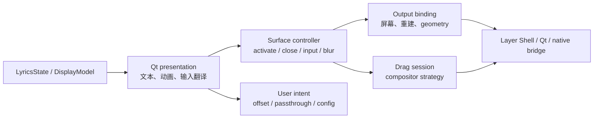

# Overlay 与平台相关 PR 行为矩阵

## Scope

- **目标**：还原最近 40 个提交中改变 overlay 展示、输入、输出绑定、拖拽、blur、窗口能力或 settings 平台行为的 PR。
- **包含**：`#25`、`#27-#31`、`#35`、`#38-#39`、`#44`、`#46-#47`、`#54-#55`、`#59-#60`、`#62`、`#64`。
- **排除**：纯歌词 provider/network 行为；它们见歌词矩阵。

## 展示路径



## PR 行为目录

| PR | 实际改变的行为（Observed） | 必须明确的行为契约 | 目标归属 |
| --- | --- | --- | --- |
| `#25` | 将 platform decisions 从 UI/入口移到 platform package，集中 capability probe/adapter 选择。 | compositor facts 只能在 platform adapter 产生；presentation 不能读取 desktop/Qt platform name 自己决策。 | `infrastructure/platform_probe` + `platform/ports` |
| `#27` | 引入 `OverlayPlatform` contract、capabilities、operation result 和 provider registry。 | capability、operation success、unavailable reason、live probe 与 snapshot 的语义必须分开；Protocol 不是行为保证。 | `platform/ports` |
| `#28` | Overlay 从直接调用 native bridge 改为调用 platform contract。 | widget 只依赖 `OverlayPlatform`；native handle、ctypes、compositor protocol 不得穿透 presentation。 | `presentation/overlay` -> `platform/ports` |
| `#29` | 将拖拽替换为 strategy；Layer Shell 和普通窗口有不同移动模型；失败的 move 不应持久化未发生的位置。 | `DragSession` 只有一种状态机；strategy 只提供 compositor delta，持久化由 application 根据 `Applied/Rejected` 决定。 | `platform/drag` + `application/overlay` |
| `#30` | 将 output lifecycle、surface release、debounced rebuild、blur object ownership 移入 Layer Shell adapter；随后修复跨屏、关闭后回调、失败重建、stale mode 等回归。 | 创建 surface 的 owner 负责 release；output binding 是资源状态机；失败重建必须保留 pending intent；deferred callback 必须检查 alive。 | `platform/surface_lifecycle` |
| `#31` | session probe 只做一次；SettingsDialog 通过同一 factory 取得 capability；补充架构 import guard。 | composition root 负责 probe/wiring；settings/overlay 不能各自猜能力；静态架构测试要检查依赖方向而非仅几个 import。 | composition root + platform registry |
| `#35` | 增加 niri drag model；KWin 用 local delta，niri 用 global delta；后续用 `NIRI_SOCKET` 而非只看 desktop 名；抽出共享 drag body。 | compositor-specific behavior 是 strategy 数据/算法，不得复制完整 lifecycle；环境探测在 composition boundary 一次完成。 | `platform/drag` |
| `#38` | Overlay control bar 增加每曲目 ±50 ms offset；按 normalized title/artist 保存，最多 100 条，±10s；按钮仅在可交互时显示。 | offset 是 track timeline policy，不是 widget 内部临时值；key、clamp、eviction、apply timing 属于 domain/config contract。 | `domain/timing` + `application/settings` + presentation intent |
| `#39` | Settings player rows 显示 identity，解决 picker 与 poll 的选择排序不一致。 | 一个 `PlayerSelectionPolicy` 同时服务 runtime 和 settings；UI 只读 DTO，不复刻 fallback 顺序。 | `application/playback` |
| `#44` | 让 settings/platform tests 在真实声明的平台运行；区分 offscreen deterministic tests 与 live session opt-in。 | 平台测试必须明确环境前置条件；fake capability 测试和 compositor integration 测试不能混为一套。 | test architecture |
| `#46` | word-highlight setting 真正控制 highlight；修复 word 文本无空格时 sweep 偏移，按实际绘制文本定位。 | display model 先决定 word progress，renderer 只按 glyph/layout measurement 绘制；parser 不应假定空格。 | `domain/display_timeline` + `presentation/renderer` |
| `#47` | Settings 控件可表示范围与 Config clamp 对齐，避免 Apply 后值被悄悄截断。 | `SettingsFormState` 与 `Config` 使用同一 value constraints；转换失败要可见，不是静默改值。 | typed config/form adapter |
| `#54` | 按钮 focus style 改为明确样式，改善 settings 可见反馈。 | 这是 presentation 视觉行为，不应进入 platform capability 或业务 workflow。 | `presentation/settings` |
| `#55` | 删除后的 Qt widget 返回 unavailable handle 而非抛错；native library path 拒绝 FIFO。 | native ABI/handle 是 infrastructure boundary；late callback 的失败必须转为 typed operation failure。 | `platform/native_adapter` |
| `#59` | pause/resume 的 display clock 使用播放器实际 position，避免估算漂移。 | clock source selection 和 display rendering 分离；pause/resume 是 timeline state transition。 | `application/clock` + `domain/timeline` |
| `#60` | startup 时把当前 screen/output 告知 platform；修复 adapter `_active_output` 未初始化导致 output removal/rebuild 不工作。 | active output 绑定只能通过一个 command；不能同时直接改 widget field 和 adapter field。 | `application/overlay` -> `platform/surface_lifecycle` |
| `#62` | 与 overlay 无直接展示契约的 restart failure + LRC cap 同时合入。 | 一个 PR 应只改变一个行为边界；restart result 和 parser budget 应拆成独立变更，减少回归定位范围。 | governance/process |
| `#64` | Overlay 增加 instrumental/interlude 展示、dots/symbol/countdown、按字体扩大 fit width；同时修复 MPRIS metadata 前置错误。 | `DisplayModel` 区分 `NoTrack/Resolving/LyricsAvailable/LyricsNotFound`；当前行、transition 和 interlude 是 frame/timeline 内容；font measurement 是 renderer/layout policy。 | `domain/display` + `presentation/renderer` |

## Phase 0 决策登记

`Retain` 表示用户可见能力继续存在，`Redefine` 表示能力保留但公共契约改变，`Remove` 表示不再
承诺该行为。本矩阵目前没有需要 `Remove` 的用户能力。

| PR | 决策 | 公共输入、输出和失败语义 | Owner / test entry |
| --- | --- | --- | --- |
| `#25` | Retain | platform facts 仍由 adapter 产出；UI 不能根据 desktop 或 Qt 名称自行决策。 | `platform_probe`；`tests/test_platform_detect.py`、`tests/test_architecture.py` |
| `#27` | Redefine | capability、live probe、snapshot 和 operation result 分开；不可用能力必须带 reason，Protocol 不等于成功。 | `platform_contracts`；`tests/test_platform_capabilities.py`、`tests/test_platform_registry.py` |
| `#28` | Retain | Overlay 只调用 toolkit-free platform contract；native handle 和 compositor protocol 不越过 adapter。 | `overlay/platform adapter`；`tests/test_architecture.py`、`tests/test_overlay_platform.py` |
| `#29` | Retain | Drag session 只在平台报告 applied 后提交位置；Rejected/failed move 不持久化。 | `drag/application`；`tests/test_overlay_platform.py`、`tests/test_platform_registry.py` |
| `#30` | Retain | surface、blur、input 和 output resource 有明确 owner；rebind 失败保留 pending intent，Closed callback 被丢弃。 | `surface_lifecycle`；`tests/test_platform_registry.py`、`tests/test_overlay_platform.py` |
| `#31` | Retain | composition root 只 probe/wire 一次；settings 和 overlay 共享同一 capability adapter。 | `platform_registry`；`tests/test_platform_registry.py`、`tests/test_settings_dialog.py` |
| `#35` | Retain | compositor-specific drag 仅实现 strategy 差异；环境探测在 composition boundary 完成。 | `drag_strategy`；`tests/test_platform_registry.py` |
| `#38` | Retain | track offset 由 typed timing policy 管理，key、clamp、eviction 和 apply timing 可观察。 | `timing/application settings`；`tests/test_overlay.py`、`tests/test_config.py` |
| `#39` | Retain | runtime/settings 使用同一 player selection policy，UI 不复刻排序和 fallback。 | `playback_selection`；`tests/test_player_selection.py`、`tests/test_settings_dialog.py` |
| `#44` | Retain | deterministic fake capability 与 live compositor test 分开，并明确运行前提。 | test architecture；`tests/test_platform_*.py` |
| `#46` | Retain | display model 计算 word progress，renderer 按最终 layout text 测量；无空格文字仍正确 sweep。 | `display_timeline/renderer`；`tests/test_karaoke.py`、`tests/test_overlay.py` |
| `#47` | Retain | settings form 与 Config 共用 range/value constraint；转换或应用失败不得静默截断。 | `config/form adapter`；`tests/test_config.py`、`tests/test_settings_dialog.py` |
| `#54` | Retain | focus style 是 presentation 视觉行为，不进入 platform 或 workflow contract。 | `settings presentation`；`tests/test_settings_dialog.py` |
| `#55` | Retain | late callback、删除 widget、FIFO bridge path 都转为明确 infrastructure failure，不抛出伪成功。 | `native_adapter`；`tests/test_overlay_platform.py`、`tests/test_native.py` |
| `#59` | Redefine | clock source 是可配置 policy；Cider 不可用时保留已找到歌词并回退 MPRIS，不清空 display。 | `clock_coordinator`；`tests/test_clock.py`、`tests/test_receiver.py` |
| `#60` | Retain | output binding 只有一个 command owner；重建失败保留 pending output intent。 | `overlay_application/surface_lifecycle`；`tests/test_platform_registry.py` |
| `#62` | Redefine | restart failure 与 LRC budget 分成独立行为记录和测试，不再作为 Overlay 的混合契约。 | lifecycle governance；`BehaviorChangeRecord` |
| `#64` | Redefine | 展示 resolution state 使用 `NoTrack/Resolving/LyricsAvailable/LyricsNotFound`；当前行、transition 和 interlude 是 frame/timeline 内容，不建立 `Empty` 或 `Finished`。 | `display/renderer`；`tests/test_select.py`、`tests/test_overlay.py`、display corpus |

## Overlay 必须拥有的状态机

### Surface lifecycle

```text
Unprepared
  -> Prepared
  -> Active(output)
  -> Rebinding(output)
  -> Active(output) | Degraded(reason)
  -> Closing
  -> Closed
```

不变量：

- `Active` 才能接受 input/blur/move；失败返回 `OperationResult`，不能返回空值伪装成功。
- `Rebinding` 销毁旧 surface 前释放以旧 surface 为 key 的 blur/input 资源。
- rebinding 失败保留 `PendingOutput`，不能因为一次失败就清掉重试意图。
- deferred callback 到达 `Closed` 后只能记录/丢弃，不能触碰 QWidget。
- Qt fallback 不能实现 Layer Shell 语义的 no-op success；必须返回 capability reason 或明确的普通窗口结果。

### Drag lifecycle

```text
Idle -> Pressed -> Updating -> Released
             \-> Rejected
```

只有平台报告 update 已应用且 release 完成，application 才能提交新的 output/offset config。拖拽坐标
算法属于 strategy；config persistence、feedback 和 UI button 属于 application/presentation。

## 展示行为必须从 Overlay 中移出的规则

- 当前歌词、上下文行、翻译、interlude、word progress 和找不到歌词的原因由纯 `DisplayModel` 决定。
- `LyricsOverlay` 不知道 provider、MPRIS、Cider、cache、match confidence。
- `LyricsOverlay` 不决定 compositor capability；它只读取 `OverlayCapabilities` 和 operation result。
- `SettingsDialog` 不通过 `getattr` 枚举 Config 字段，也不自己构造 native/platform probe。
- 所有用户操作发布 typed intent，由 application 更新 Config/track timing，再回推 view model。
